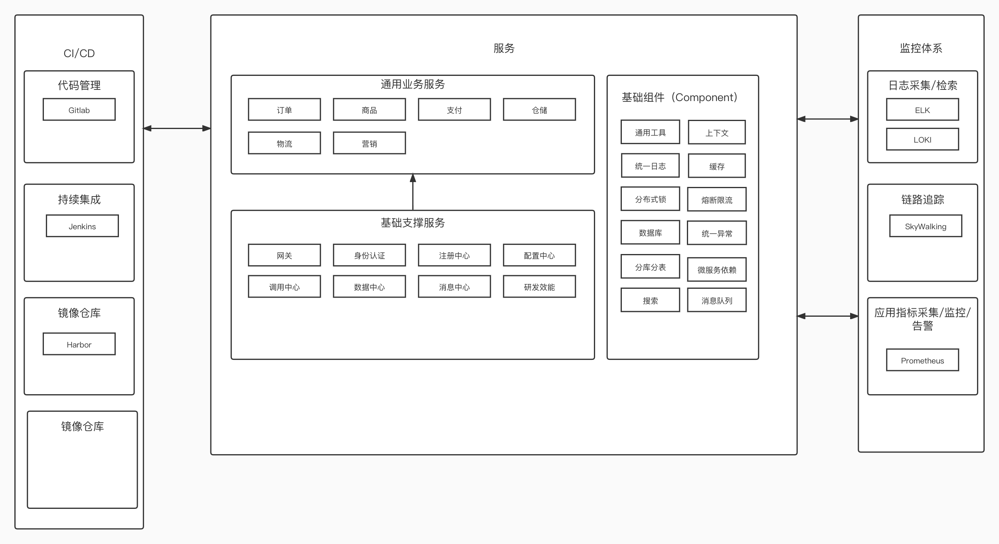

## ark这是什么？
这是我个人理想中的研发架构建设模型，整体会分为基础通用组件、基础服务、通用业务服务、监控、CI/CD、统一后台操作界面等。

## 目标
1. 提升研发效能
2. 标准化研发流程
3. 快速搭建，稳定支撑业务稳定运行

## 整体设计图


## 下载工程
```shell
git clone git@github.com:javisChen/ark-design.git
git clone git@github.com:javisChen/ark-dependencies.git
git clone git@github.com:javisChen/ark-components.git

git clone git@github.com:javisChen/ark-admin.git
git clone git@github.com:javisChen/ark-mall-ui.git

git clone git@github.com:javisChen/generator.git
git clone git@github.com:javisChen/ark-center-eop.git
git clone git@github.com:javisChen/ark-center-iam.git
git clone git@github.com:javisChen/ark-center-gateway.git
git clone git@github.com:javisChen/ark-center-oss.git
git clone git@github.com:javisChen/ark-center-order.git
git clone git@github.com:javisChen/ark-center-commodity.git
git clone git@github.com:javisChen/ark-center-pay.git


```

## 工程定义

### 统一版本管理
| 工程名称             | github                                        |
|------------------|-----------------------------------------------|
| ark-dependencies | https://github.com/javisChen/ark-dependencies |

### 基础组件
| 工程名称           | github                                      |
|----------------|---------------------------------------------|
| ark-components | https://github.com/javisChen/ark-components |

### 基础支撑服务
| 工程名称                 | github                                      | 
|----------------------|---------------------------------------------|
| 研发效能（ark-center-eop） | https://github.com/javisChen/ark-center-eop |


### 基础平台
| 工程名称                   | github                                          |
|------------------------|-------------------------------------------------|
| 网关（ark-center-gateway） | https://github.com/javisChen/ark-center-gateway |

