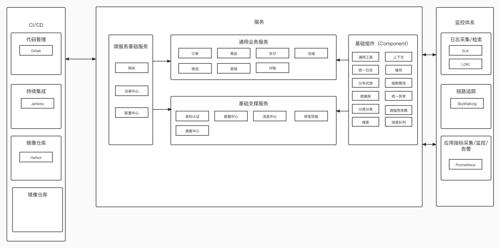

## kt-cloud这是什么？
这是我个人理想中的研发架构建设模型，整体会分为基础通用组件、基础服务、通用业务服务、监控、CI/CD、统一后台操作界面等。

## 目标
1. 提升研发效能
2. 标准化研发流程
3. 快速搭建，稳定支撑业务稳定运行

## 整体设计图


## 下载工程
```shell
git clone https://github.com/javisChen/kt-dependencies
git clone https://github.com/javisChen/kt-components
git clone https://github.com/javisChen/kt-cloud-oss
git clone https://github.com/javisChen/kt-cloud-gateway
git clone https://github.com/javisChen/kt-cloud-iam
git clone https://github.com/javisChen/kt-cloud-eop
git clone https://github.com/javisChen/kt-cloud-commodity
```

## 工程定义

### 统一版本管理
| 工程名称 | github |
|------|--------|
|kt-dependencies|https://github.com/javisChen/kt-dependencies|

### 基础组件
| 工程名称 | github |
|------|--------|
|kt-components|https://github.com/javisChen/kt-components|

### 基础支撑服务
| 工程名称                | github | 
|---------------------|--------|
| 研发效能（kt-cloud-eop）  |https://github.com/javisChen/kt-cloud-eop|


### 基础平台
| 工程名称                 | github |
|----------------------|--------|
| 网关（kt-cloud-gateway） |https://github.com/javisChen/kt-cloud-gateway|

